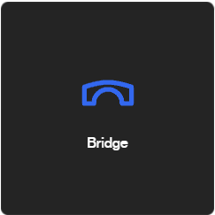
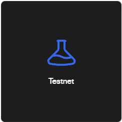
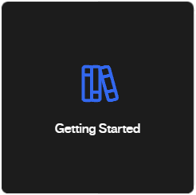
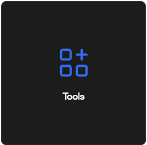

# About B3

B3 is a unified ecosystem of Base L3s powering the next era of onchain games.

Our rollup network settle on BASE, ensuring B3 transactions inherit the security of the EVM.

[Build On B3](https://b3.fun/)

[Join The Community](https://b3.fun/)

[Bridge](https://b3.fun/)

[Testnet](https://docs.b3.fun/testnet)

[Getting Started](https://docs.b3.fun/docs/introduction-to-b3)

[Tools](https://docs.b3.fun/docs/node-providers)